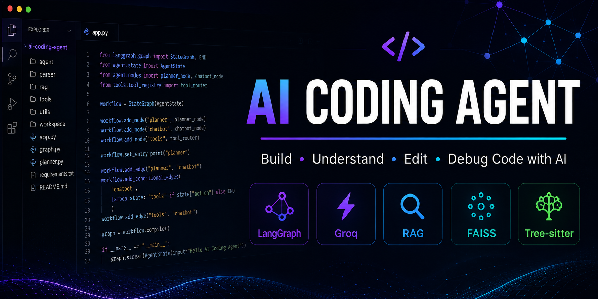
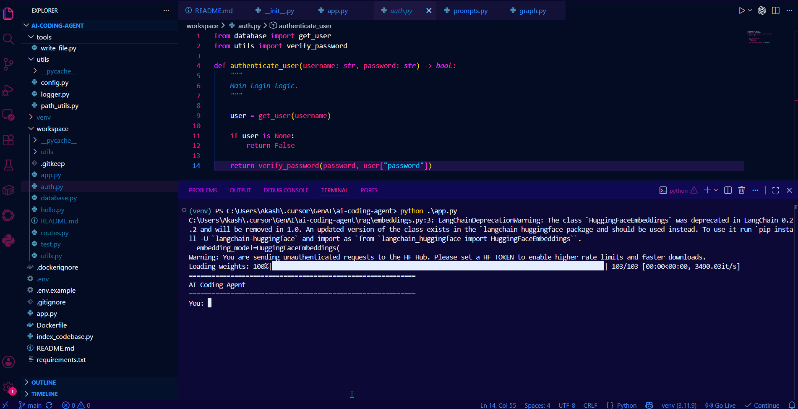
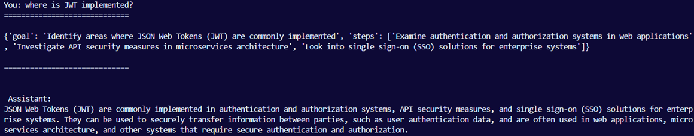
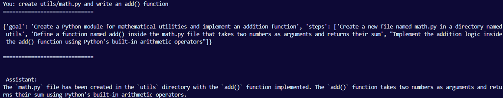
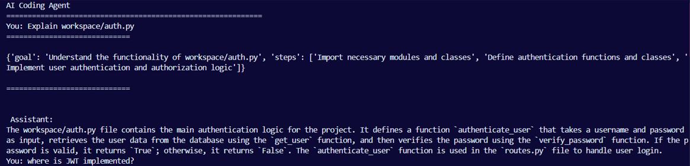

<!-- PROJECT BANNER -->

<p align="center">
  
</p>

<h1 align="center">🤖 AI Coding Agent</h1>

<p align="center">
An AI-powered Coding Assistant that understands, searches, edits, and debugs codebases using <strong>LangGraph</strong>, <strong>Groq</strong>, <strong>RAG</strong>, <strong>FAISS</strong>, and <strong>Tree-sitter</strong>.
</p>

<p align="center">


</p>

---

## 📖 Overview

Modern coding assistants such as **Cursor**, **GitHub Copilot**, and **Claude Code** rely on much more than a Large Language Model. They combine intelligent tool calling, semantic code retrieval, planning, and code understanding to assist developers throughout the software development lifecycle.

This project demonstrates how those core ideas can be implemented from scratch.

The AI Coding Agent can:

* 📂 Explore an entire codebase
* 🔍 Perform semantic code search using Retrieval-Augmented Generation (RAG)
* 📖 Read and explain source code
* 🧠 Understand code structure using AST parsing and Tree-sitter
* 📝 Create, modify, and delete project files
* 💻 Execute terminal commands
* 🐞 Explain runtime errors and tracebacks
* 🤖 Plan multi-step tasks before execution using LangGraph

The project was built with a strong focus on **AI Engineering concepts** rather than simply wrapping an LLM API. Every component is modular, making it easy to understand how modern coding assistants are designed internally.

---

<!-- # 🎬 Demo

### Demo GIF

<p align="center">

</p>

---

# 📸 Screenshots

### Chat Interface

<p align="center">

</p>

---

### Tool Calling

<p align="center">

</p>

---

### Planning + Code Retrieval

<p align="center">

</p> -->

---

# ✨ Features

## 🧠 AI Agent

* LangGraph-powered agent workflow
* Multi-step task planning
* Conversation state management
* Intelligent tool selection

---

## 📂 Code Understanding

* Read source files
* Explain code
* Search files
* Extract code structure
* Understand functions, classes, and imports

---

## 🔍 Code RAG

* Semantic code search
* Sentence Transformer embeddings
* FAISS vector database
* Context-aware retrieval

---

## 🛠️ Code Editing

* Create new files
* Modify existing files
* Delete files
* Workspace sandbox protection

---

## 💻 Development Tools

* Execute terminal commands
* Explain Python tracebacks
* Debug runtime errors

---

## 🐳 Production Ready

* Docker support
* Environment variable configuration
* Modular project architecture
* Clean separation of concerns
* Logging support

---

## 🎯 Learning Objectives

This project demonstrates practical implementation of:

* AI Agents
* Tool Calling
* Retrieval-Augmented Generation (RAG)
* LangGraph Workflows
* Embeddings
* FAISS Vector Search
* Tree-sitter
* Python AST
* Context Management
* Multi-step Planning
* Docker

---
# 🏗️ System Architecture

The AI Coding Agent follows a modular architecture where every component has a single responsibility. Instead of directly sending user prompts to the LLM, the agent first plans the task, retrieves relevant project context, selects appropriate tools, and finally generates an informed response.

```text
                         User
                           │
                           ▼
                    LangGraph Workflow
                           │
                  ┌────────┴────────┐
                  │                 │
             Planner Node      Chatbot Node
                                    │
                             Tool Selection
                                    │
      ┌──────────────┬──────────────┼───────────────┐
      │              │              │               │
      ▼              ▼              ▼               ▼
 Code RAG      File Operations   Terminal      Code Structure
      │              │              │               │
      └──────────────┴──────────────┴───────────────┘
                             │
                             ▼
                        Workspace
```

---

# 🔄 Project Workflow

Every request follows the same execution pipeline.

```text
User Request
      │
      ▼
Generate Execution Plan
      │
      ▼
Determine Required Tool(s)
      │
      ▼
Retrieve Relevant Code (if needed)
      │
      ▼
Execute Tool(s)
      │
      ▼
LLM Generates Final Response
```

For example, when the user asks:

> Explain how authentication works.

The workflow becomes:

```text
User Question
      │
      ▼
Planner
      │
      ▼
retrieve_code()
      │
      ▼
Relevant Code Chunks
      │
      ▼
(Optional) read_file()
      │
      ▼
LLM
      │
      ▼
Explanation
```

---

# 📁 Project Structure

```text
ai-coding-agent/
│
├── agent/
│   ├── graph.py
│   ├── nodes.py
│   ├── planner.py
│   ├── planner_prompt.py
│   ├── prompts.py
│   └── state.py
│
├── parser/
│   ├── ast_parser.py
│   └── tree_sitter_parser.py
│
├── rag/
│   ├── loader.py
│   ├── chunker.py
│   ├── embeddings.py
│   ├── retriever.py
│   └── vector_store.py
│
├── tools/
│   ├── read_file.py
│   ├── write_file.py
│   ├── create_file.py
│   ├── delete_file.py
│   ├── list_files.py
│   ├── search_files.py
│   ├── retrieve_code.py
│   ├── code_structure.py
│   ├── terminal.py
│   └── debug_error.py
│
├── utils/
│   ├── config.py
│   ├── logger.py
│   └── path_utils.py
│
├── workspace/
├── logs/
├── faiss_index/
│
├── app.py
├── index_codebase.py
├── requirements.txt
├── Dockerfile
├── .env.example
└── README.md
```

---

# ⚙️ Installation

## 1. Clone the Repository

```bash
git clone https://github.com/<your-username>/ai-coding-agent.git

cd ai-coding-agent
```

---

## 2. Create Virtual Environment

### Windows

```bash
python -m venv venv

venv\Scripts\activate
```

### macOS / Linux

```bash
python3 -m venv venv

source venv/bin/activate
```

---

## 3. Install Dependencies

```bash
pip install -r requirements.txt
```

---

## 4. Configure Environment Variables

Copy the example environment file.

```bash
cp .env.example .env
```

Add your Groq API key.

```env
GROQ_API_KEY=your_groq_api_key

MODEL_NAME=llama-3.3-70b-versatile

LOG_LEVEL=INFO
```

---

## 5. Index Your Codebase

Place the project you want the AI agent to analyze inside the `workspace/` directory.

Build the vector index.

```bash
python index_codebase.py
```

---

## 6. Start the Agent

```bash
python app.py
```

The AI Coding Agent is now ready.

---

# 🐳 Running with Docker

## Build the Docker Image

```bash
docker build -t ai-coding-agent .
```

---

## Run the Container

```bash
docker run --env-file .env -it ai-coding-agent
```

---

# 🔑 Environment Variables

| Variable       | Description     | Required |
| -------------- | --------------- | -------- |
| `GROQ_API_KEY` | Groq API Key    | ✅        |
| `MODEL_NAME`   | Groq Model Name | ✅        |
| `LOG_LEVEL`    | Logging Level   | Optional |

---

# 📌 Notes

* All file operations are restricted to the `workspace/` directory.
* Build the FAISS index whenever the contents of the workspace change.
* The agent only operates on indexed repositories placed inside the workspace.
* The project is fully Dockerized for consistent local execution.

---
# 🧠 AI Architecture

Unlike traditional chatbots, this project is built as an **AI Agent** that combines Large Language Models, tool calling, semantic retrieval, and structured planning to understand and interact with software projects.

Instead of relying solely on the LLM's internal knowledge, the agent dynamically gathers context from the target codebase before generating a response.

The high-level execution flow is shown below.

```text
                    User
                      │
                      ▼
                LangGraph Agent
                      │
        ┌─────────────┴─────────────┐
        │                           │
   Planner Node               Chatbot Node
                                      │
                               Tool Selection
                                      │
        ┌──────────────┬──────────────┼──────────────┐
        ▼              ▼              ▼              ▼
   Code RAG      File Operations   Terminal     Code Structure
        │
        ▼
 Relevant Context
        │
        ▼
      Response
```

---

# 🕸️ LangGraph Workflow

The project uses **LangGraph** to orchestrate the execution flow instead of making a single LLM API call.

Every user request follows a graph-based workflow:

```text
START

↓

Planner

↓

Chatbot

↓

Need Tool?

├───────────────┐
│               │
No              Yes
│               │
▼               ▼
END         Execute Tool
                │
                ▼
           Chatbot
                │
                ▼
               END
```

Using LangGraph provides:

* Stateful conversations
* Multi-step execution
* Tool orchestration
* Extensible architecture
* Clear separation between planning and execution

---

# 📋 Planning

Before responding, the agent first creates an execution plan.

For example:

**User**

```text
Explain how authentication works.
```

Planner Output

```json
{
  "goal": "Explain authentication flow",
  "steps": [
    "Retrieve relevant code",
    "Read important files",
    "Generate explanation"
  ]
}
```

The planner does **not** execute any tools.

Its only responsibility is deciding **what should happen**, allowing the chatbot node to perform the required actions.

---

# 🔍 Code RAG Pipeline

Large codebases cannot be sent directly to an LLM because of context window limitations.

Instead, the project uses **Retrieval-Augmented Generation (RAG)**.

The indexing pipeline is:

```text
Repository

↓

Document Loader

↓

Code Chunking

↓

Sentence Transformer Embeddings

↓

FAISS Vector Database
```

During inference:

```text
User Question

↓

Embedding

↓

Similarity Search

↓

Relevant Code Chunks

↓

LLM

↓

Final Response
```

Only the most relevant code is supplied to the LLM, reducing token usage while improving answer quality.

---

# 🛠️ Tool Calling

Rather than answering only from the model's knowledge, the AI agent can invoke external tools whenever additional information or actions are required.

Implemented tools include:

| Tool             | Purpose                                 |
| ---------------- | --------------------------------------- |
| `retrieve_code`  | Semantic code retrieval using FAISS     |
| `read_file`      | Read file contents                      |
| `list_files`     | List project files                      |
| `search_files`   | Search for files by name                |
| `code_structure` | Extract functions, classes, and imports |
| `run_terminal`   | Execute terminal commands               |
| `debug_error`    | Explain runtime errors                  |
| `create_file`    | Create new files                        |
| `write_file`     | Modify existing files                   |
| `delete_file`    | Delete files                            |

The LLM decides **which tool to call** based on the user's request.

---

# 🌳 Code Understanding

The project combines two complementary approaches for understanding source code.

## Python AST

The built-in Python AST module is used to extract:

* Classes
* Functions
* Imports

This provides structured information that is difficult to obtain from plain text alone.

---

## Tree-sitter

Tree-sitter parses source code into a syntax tree.

Unlike Python's AST module, Tree-sitter supports multiple programming languages, making the architecture extensible beyond Python.

Current implementation demonstrates Tree-sitter parsing for Python while keeping the project ready for future multi-language support.

---

# 🧩 Workspace Sandboxing

To prevent accidental modification of files outside the target project, all file operations are restricted to the `workspace/` directory.

Every read, write, create, and delete operation passes through a workspace path validator before execution.

This ensures the agent only interacts with the intended codebase.

---

# 💻 Terminal Execution

The AI agent can execute terminal commands inside the workspace and use the command output as additional context.

Example workflow:

```text
User

↓

Run pytest

↓

Terminal

↓

Test Output

↓

LLM

↓

Summary
```

This enables the agent to assist with common development workflows such as running scripts, executing tests, or inspecting command output.

---

# 🐞 Error Analysis

Runtime errors can be difficult to interpret.

The debugging workflow is:

```text
Execute Program

↓

Traceback

↓

Debug Tool

↓

LLM

↓

Explanation

↓

Suggested Fix
```

Instead of only displaying a traceback, the agent explains:

* What happened
* Why it happened
* Possible solutions

This makes debugging more accessible, especially for complex Python errors.

---

# 🏛️ Design Principles

The project was intentionally designed around a few core engineering principles.

### Modular Architecture

Each component has a single responsibility, making the project easier to understand, maintain, and extend.

### Separation of Concerns

Planning, retrieval, parsing, tool execution, and response generation are implemented independently rather than tightly coupled.

### Retrieval Before Generation

Instead of relying solely on the LLM's internal knowledge, the agent retrieves relevant project context before producing an answer.

### Workspace Isolation

All file operations are constrained to a dedicated workspace directory to avoid unintended access outside the target project.

### Production-Oriented Structure

The repository follows a clean project organization inspired by production AI applications while remaining approachable for learning purposes.

---
# 💬 Example Prompts

Below are a few example prompts you can use to interact with the AI Coding Agent.

---

## 📖 Code Understanding

```text
Explain workspace/auth.py
```

```text
How does the authentication flow work?
```

```text
What does the login function do?
```

```text
Explain the purpose of this repository.
```

---

## 🔍 Code Search

```text
Search for authentication files.
```

```text
Where is JWT implemented?
```

```text
Find all database-related files.
```

```text
List every Python file.
```

---

## 🌳 Code Structure

```text
Show the structure of workspace/auth.py
```

```text
List all functions inside app.py.
```

```text
Show all imports in main.py.
```

---

## ✏️ Code Editing

```text
Create workspace/utils/math.py with an add() function.
```

```text
Replace "Hello" with "Welcome" in app.py.
```

```text
Delete workspace/test.py.
```

---

## 💻 Terminal

```text
Run python workspace/app.py
```

```text
Run pytest
```

```text
Run pip list
```

---

## 🐞 Debugging

```text
Explain this traceback.
```

```text
Why am I getting this NameError?
```

```text
How can I fix this IndexError?
```

---

# 🎯 Skills Demonstrated

This project demonstrates practical implementation of several core AI Engineering concepts.

### AI Engineering

* AI Agents
* Tool Calling
* LangGraph Workflows
* Retrieval-Augmented Generation (RAG)
* Context Management
* Multi-step Planning
* Prompt Engineering
* Semantic Search

---

### LLM Engineering

* Groq API Integration
* Structured Prompt Design
* Context Injection
* Conversation State Management

---

### Retrieval Systems

* Sentence Transformers
* Vector Embeddings
* FAISS Vector Database
* Code Retrieval Pipeline

---

### Code Intelligence

* Python AST
* Tree-sitter
* Code Parsing
* Source Code Analysis

---

### Software Engineering

* Modular Architecture
* Docker
* Logging
* Environment Variables
* Workspace Sandboxing
* CLI Application Development

---

# 🚀 Why This Project?

Modern AI coding assistants are far more than chat interfaces connected to an LLM.

This project demonstrates the fundamental building blocks behind modern coding assistants by combining:

* Intelligent tool calling
* Semantic code retrieval
* Structured planning
* Code understanding
* Workspace-aware file operations
* Terminal interaction
* Runtime error analysis

Rather than relying only on the language model's internal knowledge, the agent retrieves project-specific context and interacts with the codebase through tools before generating responses.

---

# 📈 Learning Outcomes

Building this project provides hands-on experience with:

* Designing AI agent workflows using LangGraph
* Building a Code RAG pipeline from scratch
* Working with vector databases and embeddings
* Implementing autonomous tool calling
* Understanding source code using ASTs and Tree-sitter
* Managing LLM context efficiently
* Creating production-style Python project structures
* Dockerizing AI applications

---

# 🚀 Future Improvements

The current implementation focuses on the core concepts behind AI coding assistants.

Potential future enhancements include:

* Git integration
* Incremental vector index updates
* Multi-language Tree-sitter support
* Streaming responses
* Web-based user interface
* Patch-based code editing instead of full file replacement
* Support for additional vector databases (Qdrant, Weaviate)
* Authentication and user sessions
* Cloud deployment
* Multi-agent collaboration

---

# ❓ Troubleshooting

## Groq API Key Not Found

Ensure your `.env` file contains:

```env
GROQ_API_KEY=your_api_key
```

---

## FAISS Index Missing

Before starting the agent, build the vector index:

```bash
python index_codebase.py
```

---

## No Files Retrieved

Verify that the repository you want to analyze is placed inside the `workspace/` directory before indexing.

---

## Docker Issues

If Docker fails to build due to a large build context, ensure your `.dockerignore` excludes directories such as:

* `venv/`
* `workspace/`
* `faiss_index/`
* `logs/`
* `.git/`

---

## Tool Doesn't Execute

Verify that:

* The requested file exists inside the `workspace/` directory.
* The workspace has been indexed.
* The Groq API key is configured correctly.

---

# ⭐ If You Found This Project Helpful

If this project helped you understand AI agents, Code RAG, or LangGraph, consider giving the repository a ⭐.

It helps others discover the project and supports future improvements.

---
# 🤝 Contributing

Contributions are welcome!

If you'd like to improve the project, feel free to:

* Report bugs
* Suggest new features
* Improve documentation
* Refactor existing code
* Submit pull requests

If you're planning a major change, please open an issue first to discuss the proposed improvement.

---

# 📜 License

This project is licensed under the **MIT License**.

You are free to use, modify, and distribute this project under the terms of the MIT License.

For more details, see the `LICENSE` file.

---

# 🙏 Acknowledgements

This project was built using the following open-source tools and libraries:

* LangGraph
* LangChain
* Groq
* FAISS
* Sentence Transformers
* Tree-sitter
* Python AST
* Docker

Special thanks to the open-source community for building and maintaining these amazing tools.

---

# 👨‍💻 Author

**Akash Bharangar**

AI Engineer | GenAI Engineer | Backend Developer

I'm passionate about building AI applications powered by Large Language Models, Retrieval-Augmented Generation (RAG), AI Agents, and modern backend systems.

---

## 📬 Connect With Me

**GitHub**  
[github.com/akashbharangar](https://github.com/akashbharangar)

**LinkedIn**  
[linkedin.com/in/akash-bharangar-757440186](https://www.linkedin.com/in/akash-bharangar-757440186/)

**X (Twitter)**  
[x.com/akaaaaashhhhh](https://x.com/akaaaaashhhhh)

---

# 🌟 Support

If you found this project useful or learned something from it:

* ⭐ Star the repository
* 🍴 Fork the project
* 🛠️ Build on top of it
* 📢 Share it with others

Your support helps make the project more visible and encourages further development.

---

# 📌 Key Highlights

* 🤖 LangGraph-based AI Coding Agent
* 🔍 Semantic Code Search with RAG + FAISS
* 🧠 Multi-step Planning Workflow
* 🛠️ Intelligent Tool Calling
* 🌳 Code Structure Analysis using AST & Tree-sitter
* ✏️ File Creation, Editing & Deletion
* 💻 Terminal Execution & Error Explanation
* 🐳 Dockerized for Easy Deployment
* 🔒 Workspace Sandboxing for Safe File Operations

---

<p align="center">

### ⭐ If you enjoyed this project, don't forget to leave a star! ⭐

Built with ❤️ using **Python**, **Groq**, **LangGraph**, **FAISS**, and **Tree-sitter**.

</p>
